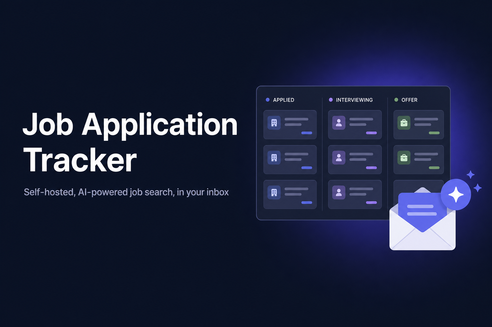
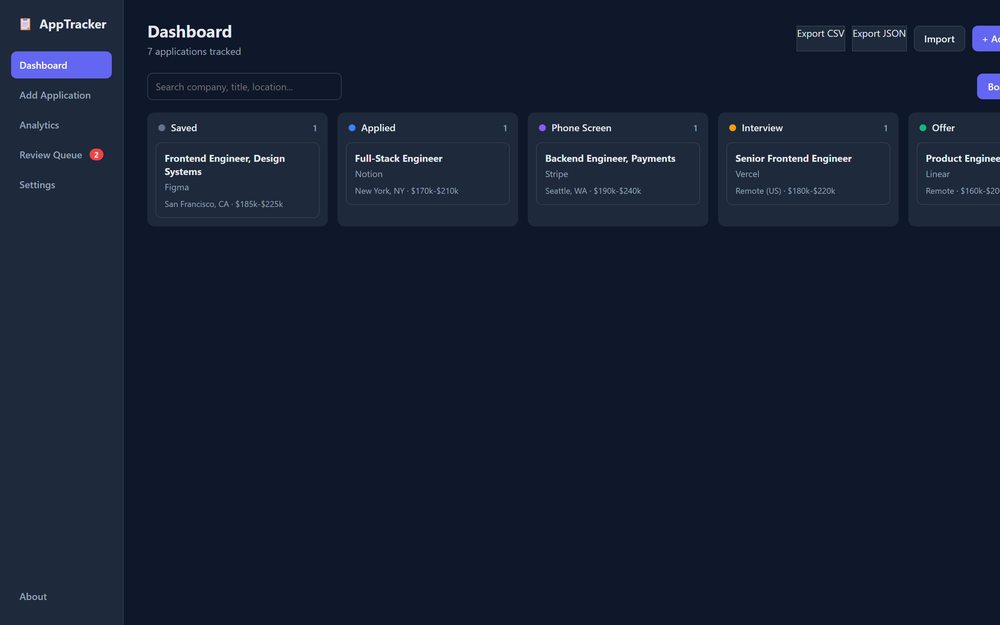
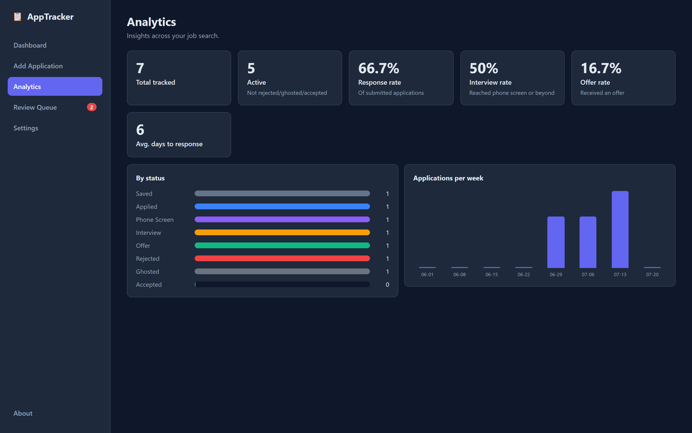
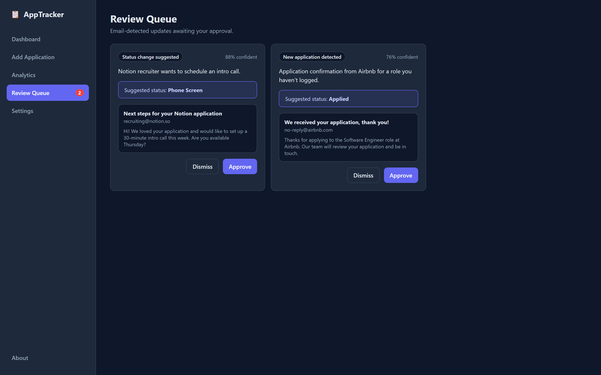
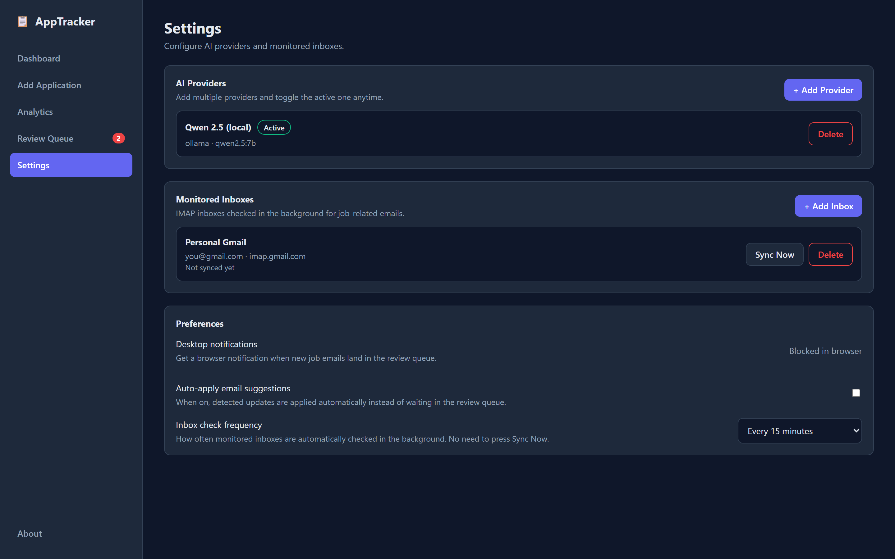

<p align="center">
  
</p>

<h1 align="center">Job Application Tracker</h1>

<p align="center">
  <strong>Self-hosted, AI-powered job application tracker that reads your inbox.</strong><br />
  Bring your own model — OpenAI, Claude, Gemini, or a local Ollama model. No accounts, no servers, no cost.
</p>

<p align="center">
  <a href="#quickstart"></a>
  
  
  
  
</p>

---

Track your job search end to end. Paste a job listing and AI fills in the details; connect your email and it detects confirmations, interviews, and rejections and updates your board automatically. Everything runs locally on your machine.

## Screenshots

| Dashboard (kanban board) | Analytics |
| --- | --- |
|  |  |

| Review queue | Settings |
| --- | --- |
|  |  |

> Want to regenerate these? Run `cd backend && python -m scripts.seed_demo --reset` to load demo data, then `make dev` and capture the screens.

## Features

- **Kanban board + table** to track applications across stages: Saved, Applied, Phone Screen, Interview, Offer, Rejected, Ghosted, Accepted.
- **Paste-to-add**: paste any job listing and an LLM extracts the company, title, location, salary, URL, skills, and a summary. Review, then save.
- **Browser extension**: capture the job listing on the page you're viewing in one click (see [`extension/`](extension/)).
- **Inbox monitoring (IMAP)**: connect any email provider. A background job reads new mail, detects job-related messages (confirmations, recruiter outreach, interview invites, rejections), matches them to your applications, and proposes updates.
- **Review queue**: proposed changes wait for your approval by default (flip on auto-apply if you trust it).
- **Drag-and-drop board** plus **desktop notifications** when new job emails need review.
- **Analytics**: response rate, interview rate, offer rate, average days to response, and applications-per-week.
- **CSV / JSON import and export** so you can bring in an existing spreadsheet or back up your data.
- **Multiple AI providers, toggleable**: configure several providers with their own keys and models, and switch the active one anytime. Local models via Ollama are fully supported.
- **Per-application timeline** recording every status change and email event.
- **Secrets encrypted at rest**: API keys and email passwords are encrypted with a locally generated key.

## Tech stack

- **Backend**: Python, FastAPI, SQLAlchemy, SQLite, APScheduler, LiteLLM (unified LLM interface).
- **Frontend**: React, TypeScript, Vite, TanStack Query.

## Architecture

```
frontend (React)  ->  backend (FastAPI)  ->  SQLite
                             |-> LLM layer (LiteLLM) -> OpenAI / Anthropic / Gemini / Ollama
                             |-> IMAP poller (APScheduler) -> your inbox -> review queue
```

## Quickstart

Requires **Python 3.11+** and **Node 18+**.

```bash
git clone <your-repo-url> application-tracker
cd application-tracker
make setup   # install backend + frontend dependencies (run once)
make app     # build the frontend, then launch the tray app
```

The app sits in the system tray (it does not auto-open the browser).
Right-click the tray icon to **Open**, run a **Health Check**, enable **Start on Login**, or **Quit**.

> **Windows note:** `make` isn't built in — install it with `winget install GnuWin32.Make` or use [Git Bash](https://gitforwindows.org/).  
> Alternatively run the two commands manually:
> ```powershell
> cd frontend; npm run build; cd ..
> backend\.venv\Scripts\python backend\launcher.py
> ```

### For contributors (live reload)

```bash
make dev    # backend on :8000 + Vite dev server on :5173 simultaneously
```

### Docker

```bash
docker compose up --build   # available at http://localhost:8080
```

Run `make help` to see all available commands.

## First-time setup

1. Open the app and go to **Settings**.
2. Under **AI Providers**, add a provider:
   - **OpenAI / Anthropic / Gemini**: pick a model and paste your API key.
   - **Ollama**: no key needed. Install [Ollama](https://ollama.com), run `ollama pull llama3.1`, and make sure it's running at `http://localhost:11434`.
   - You can add several and use **Set Active** to switch between them anytime.
3. (Optional) Under **Monitored Inboxes**, add an IMAP account and click **Test Connection**.
   - For Gmail/Outlook, create an **app password** (not your normal password) and use that.
   - Common IMAP hosts: `imap.gmail.com` (993), `outlook.office365.com` (993).
4. Go to **Add Application**, paste a job listing, and click **Parse with AI**.

## Configuration

Backend settings are read from environment variables or a `backend/.env` file (see `backend/.env.example`):

| Variable | Default | Description |
| --- | --- | --- |
| `DATA_DIR` | `./data` | Where the SQLite DB and encryption key live. |
| `FRONTEND_ORIGIN` | `http://localhost:5173` | Allowed CORS origin. |
| `EMAIL_POLL_INTERVAL_SECONDS` | `900` | Default inbox poll interval (changeable in Settings). |
| `APP_SECRET_KEY` | auto-generated | Override the encryption key (base64 urlsafe, 32 bytes). |

## Security notes

- This is a **single-user, local-first** app with no authentication by default. Don't expose it directly to the public internet without adding auth and TLS.
- API keys and email passwords are encrypted at rest using a key stored in `DATA_DIR/secret.key`. Keep that file (and your `data/` directory) private and backed up. If you lose the key, stored secrets can't be decrypted.
- Your email/API credentials never leave your machine except to talk to the providers you configure.

## Testing

```bash
# Backend (pytest)
cd backend
pip install -r requirements-dev.txt
pytest

# Frontend (vitest)
cd frontend
npm run test
```

Both suites also run automatically in CI on every push and pull request.

## API

Interactive API docs are available at http://localhost:8000/docs when the backend is running.

## Packaging a Windows `.exe` (optional)

For a single-file tray app without needing Python on the target machine:

```bash
make setup
make build
pip install pyinstaller
make dist    # writes dist/AppTracker.exe
```

Or manually:

```powershell
cd frontend; npm run build; cd ..
backend\.venv\Scripts\pip install pyinstaller
backend\.venv\Scripts\pyinstaller --noconfirm backend\apptracker.spec
```

The first run may still need Visual C++ redistributables. Prefer keeping the project off OneDrive/cloud-synced folders — `node_modules` and `.venv` thrash sync clients.

## Roadmap / ideas

See [TODO.md](TODO.md) for the planned **research agent** (web scrape to fill job description / title / location when emails are thin).

- Interview calendar (.ics) export.
- Resume-tailoring suggestions per listing.
- Notifications to Slack/Discord/email in addition to desktop.
- Optional authentication for hosted deployments.
- Firefox build of the browser extension.

Done so far: browser extension, analytics, CSV/JSON import & export, drag-and-drop board, desktop notifications, follow-up reminders, merge UI, editable review queue, sync progress, tray health check.

## Contributing

Contributions are welcome! See [CONTRIBUTING.md](CONTRIBUTING.md) for setup and guidelines. This project is intentionally simple to fork and extend.

## License

MIT. See [LICENSE](LICENSE).
